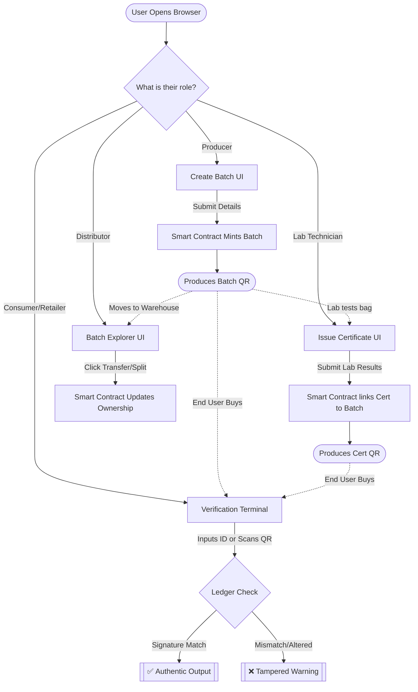

# Seed Tracking & Verification: Browser Workflow

This document outlines the core user journey through the **Seed Tracking Platform** from the browser's perspective. It explains how a participant interacts with the seed supply chain from initial registration to final consumer verification.

## Architecture Overview (Browser Perspective)
When a user accesses the platform, they interact with a React frontend. The frontend communicates with a seamless Node.js backend which coordinates the heavily lifting: IPFS decentralized storage, AI-driven fraud checks, and interaction with the Ethereum Blockchain (via Hardhat/SeedChain Contract). 

---

## The Core Lifecycle Workflow

### Stage 1: Network Entry (The Dashboard)
**URI**: `/` or `/dashboard`

When a user first opens the platform, they land on the **SeedChain Network** dashboard. 
*   **What they see:** A "Website-style" homepage highlighting global system health, network uptime, total seed supply batches, and live active transactions.
*   **Purpose:** To instill trust and allow participants (such as administrators, inspectors, or interested buyers) to verify that the blockchain layer and IPFS layers are fully responsive.

### Stage 2: Birth of a Product (Registering a Batch)
**URI**: `/create-batch`

The journey of a seed begins here. A **Seed Producer** uses this screen to input new inventory.
*   **Actionable Steps:** 
    1. The Producer navigates to *Register Seed Batch*.
    2. They select the Crop Type (e.g., Wheat), Variety, Quantity (in grams), and set an Expiration Date.
    3. They click "Execute Batch Creation".
*   **What happens under the hood:** The backend processes the request silently running an AI check to calculate a "Fraud Score". Provided the risk isn't exceptional, the batch is minted directly onto the smart contract.
*   **Browser Output:** The UI renders a success screen containing the newly generated **Batch ID**, the cryptographic **Transaction Hash**, and an immutable **IPFS Hash**, alongside a prominent **QR Code** that the producer can stick on the physical physical seed bag.

### Stage 3: Adding Quality Assurance (Issuing a Certificate)
**URI**: `/create-batch` -> *Issue Certificate Mode*

If a batch is submitted to an agricultural lab for evaluation, the Lab official logs into this terminal.
*   **Actionable Steps:**
    1. A Lab official enters the target *Batch ID*.
    2. They submit the Lab Name, Germination %, Purity %, and Moisture Content. 
    3. The browser form calculates the test result (`PASS` or `FAIL`) and registers the certificate.
*   **Browser Output:** Similar to the Batch creation, a secondary Certificate QR code and Cert ID are printed. This certificate is permanently anchored to the parent Batch.

### Stage 4: Network Movement & Logistics (Batch Explorer)
**URI**: `/batches`

Distributors, warehouse managers, and buyers monitor the Explorer.
*   **What they see:** A searchable grid of all active, transferred, and expired batches. Visual badges flag certified batches in bright blue and active batches in green.
*   **Actionable Steps:**
    *   **Transfer Ownership:** A warehouse manager finds the batch they just shipped to a retailer. They click *Transfer*, input the retailer's wallet address, and the Blockchain officially re-assigns the owner of the physical goods.
    *   **Split Batch:** If a 1000g batch needs to be sold in two 500g halves, the owner clicks *Split*, defining the new quantity. A new 'Child' batch is created dynamically.

### Stage 5: Final Validation & Trust (Consumer Verification)
**URI**: `/verify`

A Consumer or Retailer receives the physical seeds. They want to ensure it is authentic, untampered, and actually contains the germination rates the label claims.
*   **Actionable Steps:**
    1. The consumer navigates to the *Verify Seed* terminal.
    2. They have two choices: manually type the *Batch ID* / *Certificate ID* found on the bag, OR click **Scan QR Code** to use their device camera.
    3. The application queries the immutable ledger using the provided ID.
*   **Browser Output:** The UI lights up based on the exact cryptographic state:
    *   **VALID (Green):** Everything checks out. The app displays the lab that tested it, the precise purity stats pulled straight from the decentralized IPFS node, and confirmation that the digital signature matches exactly.
    *   **TAMPERED (Red):** The on-chain signature does not match the off-chain data. The user is warned not to plant or purchase the seed.

### Stage 6: Audit (Lineage / Provenance)
**URI**: `/lineage`

For deep auditing, a traceability analyst can use the Lineage page.
*   **Actionable Steps:** They input a Batch ID to trace the exact chronological history of the item.
*   **Browser Output:** A visual, chronological graph tracing from the moment the Producer initially created the batch, through every single 'Transfer' or 'Split' event, ending at the current owner.

---

## 🧭 Flowchart Visualizer

